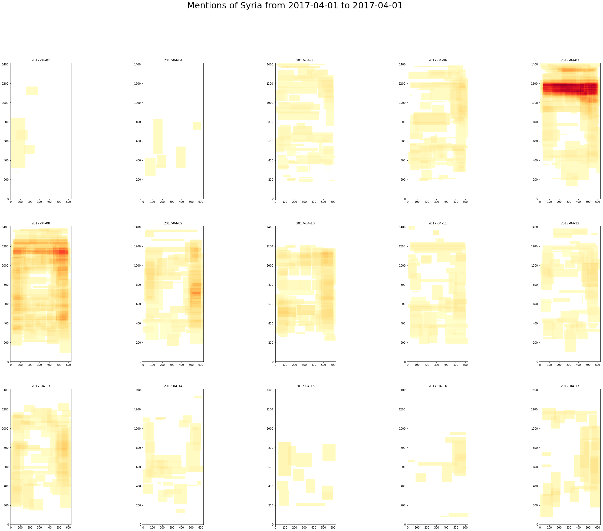

# Front page newspaper parsing



This project analyzes the front pages of newspapers from the [the Newseum website](newseum.org/todaysfrontpages/).

It consists of two sections:

* The code to download the current day's newspapers, and parse out text, bounding boxes, font sizes, and font faces.
* The analyses (mostly Jupyter notebooks) of the resulting data. See the `analysis/` subdirectory for more information.

For desired contributions, see `WISHLIST.md` :).

## Installation:
Requirements: Python 3, node, bash, qpdf, jq, OSX GNU coreutils

### System dependencies:
Only OSX is supported at the moment.

* qpdf: `brew install qpdf`
* gtimeout: `brew install coreutils`
* jq: `brew install jq`

But that is because these are terrible bash scripts. We should fix that!

### Python:
```bash
virtualenv venv
source venv/bin/activate
pip install -r requirements.txt
```

`psycopg2` is only necessary as a dependency if writing to postgres.
`ipython` is there because I use it for development.

### Node:
`npm install`

## Usage:
`./runDaily.sh` <-- This downloads the front page of today's newspapers into `date/[date]/` and performs the extractions, and loads them into a default postgres database. Note, you will need to run `createdb frontpages` to use the default settings.

#### Detailed usage:
(What `runDaily.sh` is doing:)
1. `./download.sh` <-- This downloads the front page of today's newspapers into `data/[date]/`
2. `./decrypt.sh` <-- This runs all the pdfs through a passwordless decrypt (automatically done by pdf viewers), and deletes the original pdfs.
3. `./parse.sh` <-- This extracts xml files from the decrypted pdfs, and saves them in the same data directory.
4. `python parse_xml_to_db.py XML_FILES_DIR OUTPUT_DB OUTPUT_TABLE`, where `XML_FILES_DIR` is the `data/[date]` directory above. This aggregates the XML output from the earlier steps up to the pdf textbox level, and saves it into a database. 
5. `python ingest_newspaper_metadata.py METADATA_FILE DB_URI OUTPUT_TABLE` where `METADATA_FILE` is `data/[date]-metadata.json` -- a file output by `download.sh`. This writes metadata about newspapers that haven't been seen yet to a database table.

## Analyses:
Inside of the `analysis/` directory, there is a separate README for how to setup the notebook to play with the analyses.
